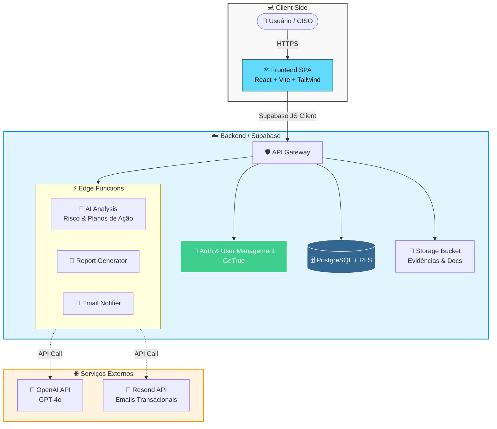

# 🛡️ CosmoSec — Plataforma GRC Open Source

<div align="center">


<br />


</div>
Plataforma completa de **Governança, Riscos e Compliance (GRC)** para organizações que levam cibersegurança a sério. Construída com React, TypeScript, Tailwind CSS e Supabase.

---

## 📋 Funcionalidades

### Módulo GRC (Frameworks)
- Diagnóstico de conformidade com **NIST CSF 2.0**, **ISO 27001:2022** e **BCB/CMN 4.893**
- Frameworks customizados com controles personalizados
- Maturidade por controle (0-5) com metas e gap analysis
- Matriz de riscos 5×5 com histórico e tratamento
- Planos de ação com IA (geração automática)
- Cofre de evidências classificadas
- Mapeamento cross-framework
- Relatórios executivos em HTML

### Módulo VRM (Gestão de Fornecedores)
- Cadastro completo de fornecedores com ciclo de vida
- Avaliação por domínios (Segurança, Cyber, Privacidade, Continuidade)
- Due diligence com checklist configurável
- Gestão de contratos, SLAs e incidentes
- Portal de qualificação para fornecedores
- Análise de risco com IA
- Offboarding estruturado

### Central de Políticas
- Editor rich-text para políticas corporativas
- Workflows de aprovação multi-nível
- Versionamento automático
- Campanhas de aceite com rastreamento
- Templates pré-definidos
- Vinculação a controles e riscos

### Recursos Gerais
- Multi-organização com convites por e-mail
- Roles: Admin, Auditor, Analyst
- Notificações em tempo real
- Trilha de auditoria completa
- Dashboard com métricas e gráficos
- Tema escuro/claro
- IA integrada (opcional)

---

## 🛠️ Pré-requisitos

- **Node.js** 18+ (recomendado: 20 LTS)
- **npm** ou **bun**
- **Docker** e **Docker Compose** (para deploy containerizado)

---

## 🚀 Setup Rápido (Desenvolvimento)

### 1. Clonar o repositório

```bash
git clone https://github.com/GuilhermeQViana/cosmosecopen.git
cd cosmosec
```

### 2. Configurar o Supabase

1. Crie um novo projeto em [supabase.com](https://supabase.com)
2. Vá em **SQL Editor** e execute o conteúdo do arquivo `supabase/schema.sql`
3. Copie a **URL**, a **anon key** e o **Project ID** (Settings → API)

### 3. Configurar variáveis de ambiente

```bash
cp .env.example .env
```

Edite o `.env` com suas credenciais:

```env
VITE_SUPABASE_URL=https://seu-projeto.supabase.co
VITE_SUPABASE_PUBLISHABLE_KEY=sua-anon-key
VITE_SUPABASE_PROJECT_ID=seu-project-id
```

### 4. Instalar dependências e rodar

```bash
npm install
npm run dev
```

Acesse `http://localhost:5173` no navegador.

> **⚠️ Erro de login "Failed to fetch"?** Veja a seção [Troubleshooting de login local](#-troubleshooting-erro-de-login-local) mais abaixo.


Após cadastrar-se na aplicação, execute no SQL Editor do Supabase:

```sql
INSERT INTO public.super_admins (user_id)
SELECT id FROM auth.users WHERE email = 'seu-email@exemplo.com';
```

---

## 🐳 Setup com Docker

### Opção 1: Self-Hosted Completo (Recomendado)

Sobe **toda a infraestrutura** com um único comando — banco de dados, autenticação, API REST, painel de administração e frontend. Não precisa de conta externa.

```bash
# 1. Clone o repositório
git clone https://github.com/GuilhermeQViana/cosmosecopen.git
cd cosmosec

# 2. Configure as variáveis de ambiente
cp .env.docker .env.local

# 3. Suba toda a stack
docker compose up --build
```

#### Serviços disponíveis

| Serviço | URL | Descrição |
|---------|-----|-----------|
| **Frontend** | `http://localhost` | Aplicação CosmoSec |
| **Studio** | `http://localhost:3001` | Painel de administração do banco |
| **API** | `http://localhost:8000` | API Gateway (Kong) |
| **PostgreSQL** | `localhost:5432` | Banco de dados (acesso direto) |

#### Após subir a stack

1. Acesse `http://localhost` e cadastre-se
2. Abra o **Studio** em `http://localhost:3001`
3. No SQL Editor do Studio, execute:

```sql
INSERT INTO public.super_admins (user_id)
SELECT id FROM auth.users WHERE email = 'seu-email@exemplo.com';
```

#### Personalização

Edite o `.env.local` para customizar:
- **Senhas**: `POSTGRES_PASSWORD`, `JWT_SECRET`
- **SMTP**: Configure `SMTP_HOST`, `SMTP_USER`, etc. para envio real de e-mails
- **Signup**: `DISABLE_SIGNUP=true` para desabilitar novos cadastros

> ⚠️ **Produção**: Troque obrigatoriamente o `JWT_SECRET` e as chaves JWT (`ANON_KEY`, `SERVICE_ROLE_KEY`). Consulte a [documentação do Supabase Self-Hosting](https://supabase.com/docs/guides/self-hosting) para gerar chaves seguras.

### Opção 2: Imagem Docker Pronta (Mais Fácil)

Baixe a imagem pré-construída do Docker Hub — **não precisa clonar o repositório nem buildar**. Só configure as variáveis de ambiente e rode.

```bash
# 1. Baixe a imagem
docker pull guilherme0045/cosmosecopen:latest

# 2. Rode com suas credenciais Supabase
docker run -d -p 80:80 \
  -e VITE_SUPABASE_URL=https://seu-projeto.supabase.co \
  -e VITE_SUPABASE_PUBLISHABLE_KEY=sua-anon-key \
  -e VITE_SUPABASE_PROJECT_ID=seu-project-id \
  guilherme0045/cosmosecopen:latest

# Frontend disponível em http://localhost
```

Ou use o Docker Compose simplificado:

```bash
# Baixe o arquivo de compose
curl -O https://raw.githubusercontent.com/GuilhermeQViana/cosmosecopen/main/docker-compose.prebuilt.yml

# Crie o .env com suas credenciais
cat > .env << EOF
VITE_SUPABASE_URL=https://seu-projeto.supabase.co
VITE_SUPABASE_PUBLISHABLE_KEY=sua-anon-key
VITE_SUPABASE_PROJECT_ID=seu-project-id
EOF

# Suba
docker compose -f docker-compose.prebuilt.yml up -d
```

### Opção 3: Frontend + Supabase Cloud

Sobe apenas o frontend via Docker, usando Supabase Cloud como backend. Ideal para produção.

```bash
# 1. Configure o .env com suas credenciais Supabase Cloud
cp .env.example .env
# Edite o .env com VITE_SUPABASE_URL, VITE_SUPABASE_PUBLISHABLE_KEY, VITE_SUPABASE_PROJECT_ID

# 2. Suba apenas o frontend
docker compose -f docker-compose.prod.yml up --build

# Frontend disponível em http://localhost:3000
```

---

## ⚡ Deploy das Edge Functions (Opcional)

Para funcionalidades como IA generativa, envio de e-mails e exportação de relatórios, faça o deploy das Edge Functions. **Funcionalidades básicas (CRUD, auth, dashboard) funcionam sem elas.**

```bash
# Instale o Supabase CLI
npm install -g supabase

# Linke ao seu projeto
supabase link --project-ref SEU_PROJECT_ID

# Deploy de todas as funções
supabase functions deploy

# Configure os secrets necessários
supabase secrets set AI_API_KEY=sua-chave-openai
supabase secrets set AI_BASE_URL=https://api.openai.com/v1/chat/completions
supabase secrets set RESEND_API_KEY=sua-chave-resend
```

> **Self-Hosted**: Para rodar Edge Functions localmente, use `supabase functions serve` (requer Supabase CLI + Deno).

---

## 📦 Build para Produção

```bash
npm run build
```

A pasta `dist/` contém os arquivos estáticos prontos para deploy. Sirva com qualquer servidor web (Nginx, Apache, Caddy, Vercel, Netlify, etc.).

---

## ⚙️ Configurações Opcionais

Configure estas variáveis como **Supabase Secrets** (Dashboard → Settings → Edge Functions → Secrets):

| Variável | Descrição |
|----------|-----------|
| `AI_API_KEY` | Chave de API compatível com OpenAI (GPT, Gemini, etc.) |
| `AI_BASE_URL` | Endpoint da API de IA (ex: `https://api.openai.com/v1/chat/completions`) |
| `RESEND_API_KEY` | Chave do [Resend](https://resend.com) para envio de e-mails |
| `ALLOWED_ORIGINS` | Origens CORS permitidas (comma-separated) |

---

### 🏗️ Arquitetura do Sistema


### Desenvolvimento / Supabase Cloud

```
Frontend (React + Vite)
    ↕ Supabase JS Client
Backend (Supabase Cloud)
    ├── PostgreSQL (banco de dados + RLS)
    ├── Auth (autenticação + OAuth)
    ├── Edge Functions (lógica de negócio)
    └── Storage (arquivos e evidências)
```

### Self-Hosted (Docker)

```
docker compose up
    │
    ├── kong (:8000)          → API Gateway
    ├── db (:5432)            → PostgreSQL 15
    ├── auth (:9999)          → GoTrue (autenticação)
    ├── rest (:3000 interno)  → PostgREST (API REST)
    ├── meta (:8080 interno)  → Postgres Meta
    ├── studio (:3001)        → Supabase Studio
    └── app (:80)             → CosmoSec (Nginx)
```

- **Frontend:** React 18, TypeScript, Tailwind CSS, Vite, shadcn/ui, Recharts
- **Backend:** Supabase (PostgreSQL 15 + Row Level Security)
- **IA:** Qualquer API compatível com OpenAI (configurável)
- **E-mail:** Resend (opcional)

---

## 📁 Estrutura do Projeto

```
cosmosec/
├── public/                    # Assets estáticos
├── src/
│   ├── components/           # Componentes React
│   │   ├── dashboard/        # Widgets do dashboard
│   │   ├── diagnostico/      # Módulo de diagnóstico
│   │   ├── fornecedores/     # Módulo VRM
│   │   ├── politicas/        # Central de políticas
│   │   ├── riscos/           # Gestão de riscos
│   │   ├── layout/           # Layout e navegação
│   │   └── ui/               # Componentes base (shadcn)
│   ├── contexts/             # React Contexts (Auth, Org, Framework)
│   ├── hooks/                # Custom hooks
│   ├── pages/                # Páginas da aplicação
│   ├── lib/                  # Utilitários
│   └── integrations/         # Integrações (Supabase)
├── supabase/
│   ├── functions/            # Edge Functions (Deno)
│   ├── migrations/           # Migrações SQL incrementais
│   └── schema.sql            # Schema consolidado
├── docker/                   # Configurações Docker
│   ├── init.sql              # Inicialização do banco
│   └── kong.yml              # Config do API Gateway
├── .env.example              # Template (Supabase Cloud)
├── .env.docker               # Template (Self-Hosted)
├── Dockerfile                # Build containerizado
├── docker-compose.yml        # Stack completa (Self-Hosted)
├── docker-compose.prod.yml   # Frontend only (Produção)
└── nginx.conf                # Configuração Nginx
```

---

## ⚡ Edge Functions

| Função | Descrição |
|--------|-----------|
| `generate-action-plan` | Gera planos de ação com IA |
| `generate-bulk-action-plans` | Geração em lote de planos |
| `generate-policy` | Gera conteúdo de políticas com IA |
| `generate-report` | Gera relatórios executivos em HTML |
| `generate-implementation-guide` | Guia de implementação por controle |
| `send-invite-email` | Envia convites por e-mail |
| `send-deadline-notifications` | Notificações de prazos |
| `notify-new-signup` | Notifica admins sobre novos cadastros |
| `send-contact-notification` | Notifica sobre contatos comerciais |
| `export-data` | Exportação de dados (Excel/CSV) |
| `import-data` | Importação de dados |
| `generate-vendor-report` | Relatório de fornecedores |
| `vendor-risk-analysis` | Análise de risco de fornecedor com IA |
| `classify-vendor-criticality` | Classificação automática de criticidade |
| `analyze-vendor-incident` | Análise de incidentes com IA |
| `assist-due-diligence` | Assistente de due diligence com IA |
| `generate-vendor-action-plans` | Planos de ação para fornecedores |
| `vendor-qualification-portal` | Portal de qualificação público |
| `export-qualification-template` | Exporta template de qualificação |
| `import-qualification-responses` | Importa respostas de qualificação |
| `export-policy-pdf` | Exporta política em PDF |

---

## 🤝 Contribuindo

Veja [CONTRIBUTING.md](./CONTRIBUTING.md) para detalhes sobre como contribuir.

---

## 📄 Licença

Este projeto está licenciado sob a [MIT License](./LICENSE).

---

## 🔧 Troubleshooting: Erro de login local

### "Invalid login credentials" (E-mail ou senha incorretos)

Este erro indica que o e-mail ou senha digitados estão errados. Verifique suas credenciais ou use a opção "Esqueci minha senha".

### "Invalid authentication credentials" (Configuração do projeto)

Este erro indica que a **URL e a chave publishable (anon key) não pertencem ao mesmo projeto**. Causas comuns:

| # | Verificação |
|---|-------------|
| 1 | **`.env.local` sobrescrevendo `.env`?** — Em Vite, `.env.local` tem prioridade. Remova ou corrija as variáveis nele. |
| 2 | **URL e chave do mesmo projeto?** — Ambas devem vir do mesmo projeto (Settings → API). |
| 3 | **Reiniciou o servidor?** — Execute `npm run dev` novamente após alterar variáveis. |

### "Failed to fetch" (Backend inacessível)

| # | Verificação |
|---|-------------|
| 1 | **Variáveis corretas?** — Confirme `VITE_SUPABASE_URL` e `VITE_SUPABASE_PUBLISHABLE_KEY` no `.env`. |
| 2 | **Backend acessível?** — Abra `<SUA_URL>/auth/v1/settings` no navegador; deve retornar JSON. |
| 3 | **Self-hosted (Docker)?** — Verifique se `auth` e `kong` estão rodando: `docker compose ps`. |
| 4 | **Botão "Testar conexão"** — Na tela de login, use-o para diagnóstico em tempo real. |

---

## 🙏 Agradecimentos

- [Supabase](https://supabase.com) — Backend open source
- [shadcn/ui](https://ui.shadcn.com) — Componentes UI
- [Tailwind CSS](https://tailwindcss.com) — Framework CSS
- [Recharts](https://recharts.org) — Gráficos React
- [Lucide](https://lucide.dev) — Ícones
